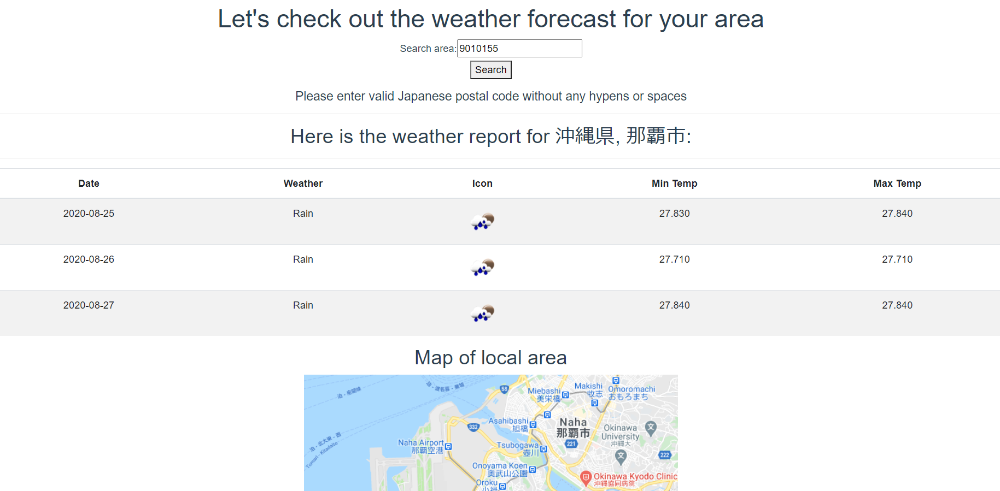

# Weather Forecast

Using a valid Japanese postal code, get a three-day weather forecast and a map of that area.

Please note that "Min Temp" and "Max Temp" are the actual min and max temperature in the city at that current time and it is used to deviation from the current temperature for your reference. 


### Here's a preview of the intro screen:



## Project setup
```
yarn install
```

### Compiles and hot-reloads for development
```
yarn serve
```

## Built With

- [Vue](https://vuejs.org/)
- [BootstrapVue](https://bootstrap-vue.org/)
- [Rakuten Rapid API](https://english.api.rakuten.net/)
- [Google Cloud API](https://cloud.google.com/apis)

## Contributing

Pull requests are welcome. For major changes, please open an issue first to discuss what you would like to change.

## License

[MIT](https://choosealicense.com/licenses/mit/)

## Author

Garrett Chun  -  [![alt text][1.1]][1]       [![alt text][1.2]][2]

[1.1]: http://i.imgur.com/9I6NRUm.png
[1.2]: ./src/assets/twitter20.png

[1]: https://github.com/KapakahiCoder
[2]: http://www.twitter.com/KapakahiCoder