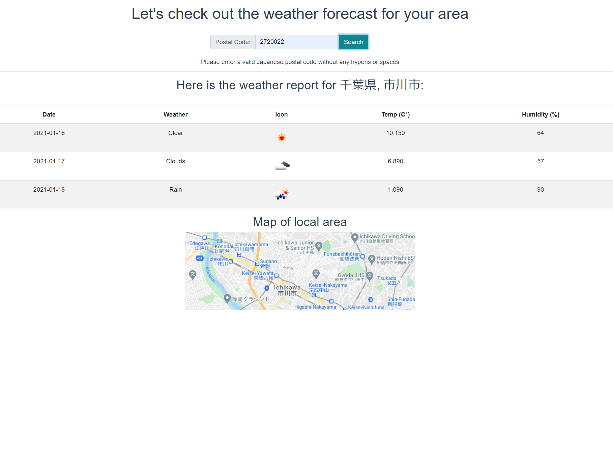

# Weather Forecast

Using a valid Japanese postal code, get a three-day weather forecast and a map of that area.

### Here's a picture of the result screen:



## Project setup

```
yarn install
```

Please rename the ".env-example" file to ".env" and enter your own RapidAPI key and Google developer key.

### Compiles and hot-reloads for development

```
yarn serve
```

## Built With

- [Vue](https://vuejs.org/)
- [BootstrapVue](https://bootstrap-vue.org/)
- [Rakuten Rapid API](https://english.api.rakuten.net/)
- [Google Cloud API](https://cloud.google.com/apis)

## Contributing

Pull requests are welcome. For major changes, please open an issue first to discuss what you would like to change.

## License

[MIT](https://choosealicense.com/licenses/mit/)

## Author

Garrett Chun - [![Github][1.1]][1] [![Twitter][1.2]][2]

[1.1]: http://i.imgur.com/9I6NRUm.png
[1.2]: ./src/assets/twitter20.png
[1]: https://github.com/KapakahiCoder
[2]: http://www.twitter.com/KapakahiCoder
