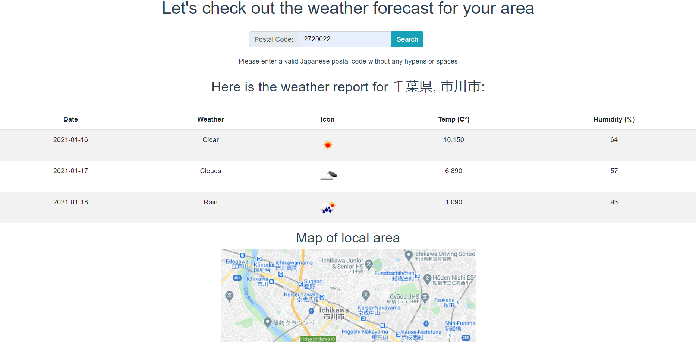

# Weather Forecast

Using a valid Japanese postal code, postal code and country name, or partial mailing address, get a three-day weather forecast and see a map of that area.

Check the weather forecast at:
[japan-weather-forecast](https://japan-weather-forecast.web.app/)

### Here's a picture of the result screen:




## Getting Started

### Project setup

Make sure to install dependencies:

```bash
npm install
```

### Development Server

Start the development server on `http://localhost:8080`:

```bash
npm run serve
```


Please rename the ".env-example" file to ".env" and enter your own RapidAPI key, Google developer key, and Open Weather key.


## Built With

- [Vue](https://vuejs.org/)
- [BootstrapVue](https://bootstrap-vue.org/)
- [Google Cloud API](https://cloud.google.com/apis)
- [Open Weather API](https://openweathermap.org/)

## Contributing

Pull requests are welcome. For major changes, please open an issue first to discuss what you would like to change.

## License

[MIT](https://choosealicense.com/licenses/mit/)

## Author

Garrett Chun - [![Github][1.1]][1] [![Twitter][1.2]][2]

[1.1]: http://i.imgur.com/9I6NRUm.png
[1.2]: ./src/assets/twitter20.png
[1]: https://github.com/KapakahiCoder
[2]: http://www.twitter.com/KapakahiCoder
